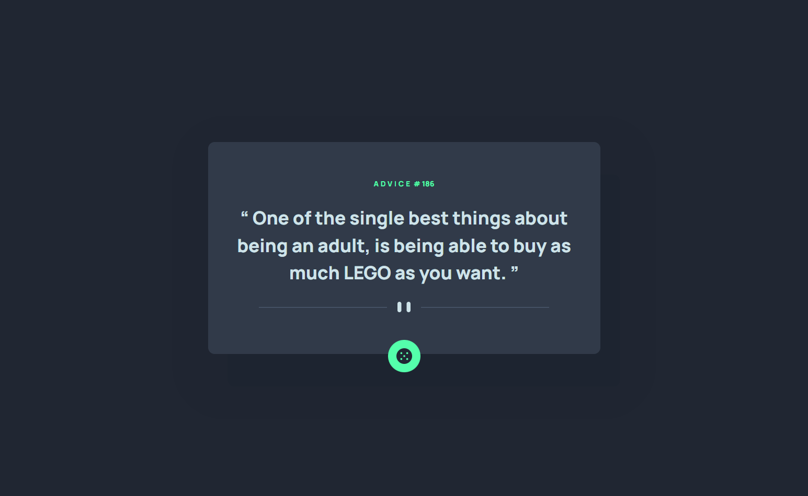

# Frontend Mentor - Advice generator app solution

This is a solution to the [Advice generator app challenge on Frontend Mentor](https://www.frontendmentor.io/challenges/advice-generator-app-QdUG-13db). Frontend Mentor challenges help you improve your coding skills by building realistic projects.

## Table of contents

- [Overview](#overview)
  - [The challenge](#the-challenge)
  - [Screenshot](#screenshot)
  - [Links](#links)
- [My process](#my-process)
  - [Built with](#built-with)
- [Author](#author)

## Overview

### The challenge

Users should be able to:

- Click on dice to generate new quote

### Screenshot of finished work

### Links

- [Live Site](https://nerijusnoreika.github.io/advice-generator-app)

## My process

### Built with

- Semantic HTML5 markup
- CSS Grid
- Mobile-first workflow
- VueJS

## Author

- [LinkedIn](https://www.linkedin.com/in/nerijus-noreika-225804154)
